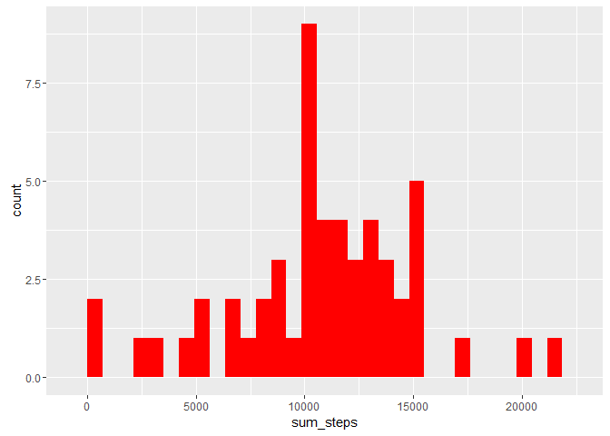
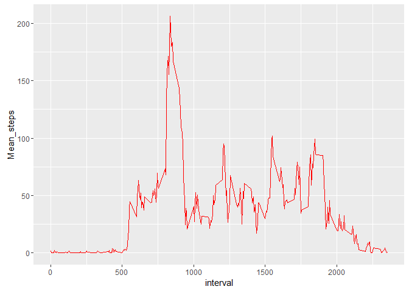
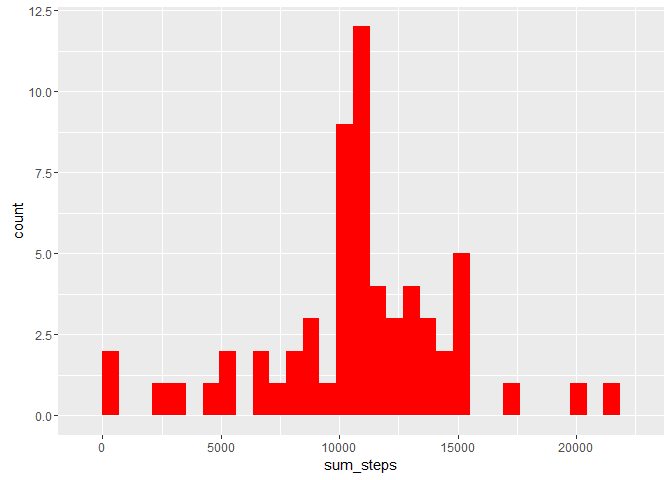
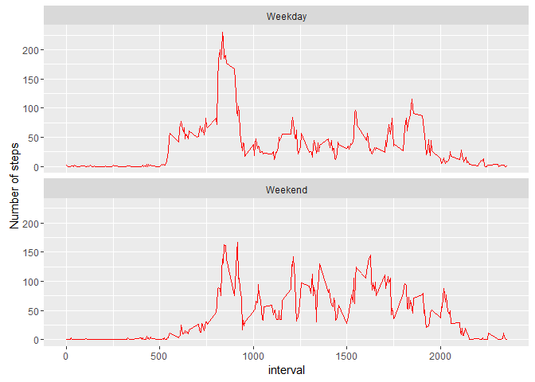

======================================================================================

Loading and preprocessing the data
----------------------------------

At this stage of the analysis, we check the sanity of the data, change
variable formats if necessary etc..

    library(dplyr)

    Assig=read.csv("C:/Yohannes/Coursera/Reproducible research/Assign1/activity.csv", stringsAsFactors = FALSE)
    str(Assig)

    ## 'data.frame':    17568 obs. of  3 variables:
    ##  $ steps   : int  NA NA NA NA NA NA NA NA NA NA ...
    ##  $ date    : chr  "2012-10-01" "2012-10-01" "2012-10-01" "2012-10-01" ...
    ##  $ interval: int  0 5 10 15 20 25 30 35 40 45 ...

    Assig$date=as.Date(Assig$date, "%Y-%m-%d")
    head(Assig)

    ##   steps       date interval
    ## 1    NA 2012-10-01        0
    ## 2    NA 2012-10-01        5
    ## 3    NA 2012-10-01       10
    ## 4    NA 2012-10-01       15
    ## 5    NA 2012-10-01       20
    ## 6    NA 2012-10-01       25

    tail(Assig)

    ##       steps       date interval
    ## 17563    NA 2012-11-30     2330
    ## 17564    NA 2012-11-30     2335
    ## 17565    NA 2012-11-30     2340
    ## 17566    NA 2012-11-30     2345
    ## 17567    NA 2012-11-30     2350
    ## 17568    NA 2012-11-30     2355

Questions
=========

1) What is mean total number of steps taken per day?
====================================================

    #Ignore missing values
    Assig2=Assig[complete.cases(Assig),]
    #The total number of steps taken per day using dplyr
    sum_by_date1=group_by(Assig2,date)%>%summarise(sum_steps=sum(steps))

2)Histogram
===========

    #Here i use ggplot2 to draw the Histogram
    library(ggplot2)

    g=ggplot(sum_by_date1,aes(sum_steps))
    g+geom_histogram(fill="red")

    #Mean and Median
    group_by(Assig2,date)%>%summarise(sum_steps=sum(steps))%>%summarise(Mean_steps=mean(sum_steps),Median_steps=median(sum_steps))

    ## Source: local data frame [1 x 2]
    ## 
    ##   Mean_steps Median_steps
    ##        (dbl)        (int)
    ## 1   10766.19        10765

    #We can see that the mean and Median value are slightly different 

2) What is the average daily activity pattern?
----------------------------------------------

    #Timeseries Plot using ggplot
    time_series=group_by(Assig2,interval)%>%summarise(Mean_steps=mean(steps))
    g=ggplot(time_series,aes(interval,Mean_steps))
    g+geom_line(col="red")+scale_x_continuous()

    #Max interval
    Max_int=group_by(Assig2,interval)%>%summarise(Mean_steps=mean(steps))%>%filter(Max_Step=(Mean_steps==max(Mean_steps)))

    #The maximum  number of steps occured at the 835 th interval

3) Imputing missing values
--------------------------

    #Total number of missing values
    sum(is.na(Assig))

    ## [1] 2304

    #Strategy (I used the mean of 5-minute interval)
    mean_int=group_by(Assig2,interval)%>%summarise(Mean_steps=mean(steps))
    #Imputed  dataset
    imputed=left_join(Assig,mean_int)%>%mutate(steps2=ifelse(is.na(steps),Mean_steps, steps))
    imputed=imputed%>%select(-steps)
    head(imputed)

    ##         date interval Mean_steps    steps2
    ## 1 2012-10-01        0  1.7169811 1.7169811
    ## 2 2012-10-01        5  0.3396226 0.3396226
    ## 3 2012-10-01       10  0.1320755 0.1320755
    ## 4 2012-10-01       15  0.1509434 0.1509434
    ## 5 2012-10-01       20  0.0754717 0.0754717
    ## 6 2012-10-01       25  2.0943396 2.0943396

    #Histogram, mean and median
    sum_by_date2=group_by(imputed,date)%>%summarise(sum_steps=sum(steps2))
    g=ggplot(sum_by_date2,aes(sum_steps))
    g+geom_histogram(fill='red')

    #Checking difference
    group_by(imputed,date)%>%summarise(sum_steps=sum(steps2))%>%summarise(Mean_steps=mean(sum_steps),Median=median(sum_steps))

    ## Source: local data frame [1 x 2]
    ## 
    ##   Mean_steps   Median
    ##        (dbl)    (dbl)
    ## 1   10766.19 10766.19

    #Now we see that mean and median values are exactly the same after imputation

4) Weekend and Weekday
----------------------

    #Creating a new factor variable
    imputed2=imputed%>%mutate(week_cat=ifelse(weekdays(date)%in% c("Saturday","Sunday"),'Weekend','Weekday'))

    #Timeseries
    head(imputed2)

    ##         date interval Mean_steps    steps2 week_cat
    ## 1 2012-10-01        0  1.7169811 1.7169811  Weekday
    ## 2 2012-10-01        5  0.3396226 0.3396226  Weekday
    ## 3 2012-10-01       10  0.1320755 0.1320755  Weekday
    ## 4 2012-10-01       15  0.1509434 0.1509434  Weekday
    ## 5 2012-10-01       20  0.0754717 0.0754717  Weekday
    ## 6 2012-10-01       25  2.0943396 2.0943396  Weekday

    time_series2=group_by(imputed2,week_cat,interval)%>%summarise(Mean_steps=mean(steps2))
    g=ggplot(time_series2,aes(interval,Mean_steps))
    g+geom_line(col="red")+scale_x_continuous()+facet_wrap(~week_cat, ncol=1)+labs(y="Number of steps")

